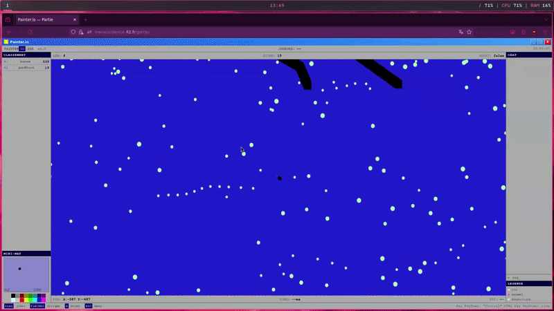
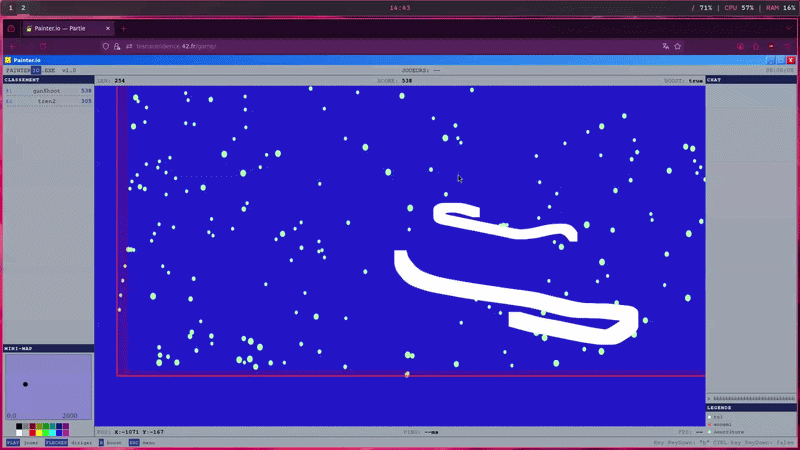

<p><em>This project has been created as part of the 42 curriculum by <b>banne</b>, <b>jhauvill</b>, <b>jcrochet</b>, <b>aronnet</b>, <b>thlibers</b> and <b>nclavel</b>.</em></p>

# ft_transcendence
## Description:
- "ft_transcendence" is the last project of the 42 Common Core. On this project we had to create a an web application that has a frontend, backend, and a database containerized on multiple containers.
- We have chosen to replicate a game that we played when we were children called "slither.io" on a old MSDOS/Windows98 theme. In this game, you play a snake eat food to grow. A snake can die when its head touches the border of the map or the body of another snake. This game doesn't really have an end, you play on the map until you die or you close the window.
## Instructions:
1. Create a .env or copy template.env file who will contain every environment variable that will be use in the infrastructure
```plaintext
# --- API ---
// The password to generate user JWT (Json Web Token)
(required) JWT_SECRET=SECRET

# --- MONGODB ---
// Username of the administator user of every databases
(required) MONGO_ADMIN_USER=ADMIN_USERNAME 
// Password of the administator user of every databases
(required) MONGO_ADMIN_PASS=ADMIN_PASSWORD

// Username of the user who manage the "database" database that contain username, email, password and the user match history
(required) MONGO_USER=USERNAME
// password of the user who manage the "database" database that contain username, email, password and the user match history
(required) MONGO_PASS=PASSWORD
```
2. Launch the infrastructure with:
```sh
make up
```
3. Shutdown the infrastructure with:
```sh
make down
```
- If you need to rebuild a container and restart the infrastructure
```sh
make re
```
- If you need to factory reset everything that is used in the container (including volumes)
```sh
# SUDO IS REQUIRED DELETE VOLUMES DATA
sudo make reset
```
- For collaborative work, 
```sh
# PUT YOUR TWO VM IN BRIDGE ADAPTER
# --- ON THE SERVER ---
# Get the enp0s3/eth0 IP
ip addr
# SUDO IS REQUIRED TO ADD YOUR USER TO THE DOCKER GROUP AND APPEND YOUR IP TO /etc/hosts
sudo make setup IP=127.0.0.1

# --- ON THE CLIENT ---
# SUDO IS REQUIRED TO ADD YOUR USER TO THE DOCKER GROUP AND APPEND YOUR IP TO /etc/hosts
sudo make setup IP=IP_GET_FROM_THE_SERVER_IPADDR
```
- To go into a docker container easly ()
```sh
make debug A=container_name

# EXAMPLE
make debug A=mongodb
# OR
make debug A=mongo		# Will put on the mongodb container
# OR
make debug A=ngi			# Will put on the nginx container
```

## Ressources :
- [Game Server](https://github.com/banne227/ft_transcendence/blob/main/docs/game_server.md)
- [Infrastructures](https://github.com/banne227/ft_transcendence/blob/main/docs/infra.md)
- [API](https://github.com/banne227/ft_transcendence/blob/main/docs/api.md)

## Preview: 
<div align=center>
	
	
</div>

<!-- "Powered By:" badges -->
<div align="center">
  <h2>Powered By:</h2>
	<a rel="Nginx" href="https://nginx.org/"></a>
	<a rel="MongoDB" href="https://www.mongodb.com/"></a>
	<a rel="NodeJS" href="https://nodejs.org"></a>
	<a rel="Typescript" href="https://www.typescriptlang.org/"></a>
	<a rel="Docker" href="https://www.docker.com/"></a>
	<a rel="ExpressJS" href="https://expressjs.com/en/"></a>
	<a rel="Socket.IO" href="https://socket.io/"></a>
</div>
